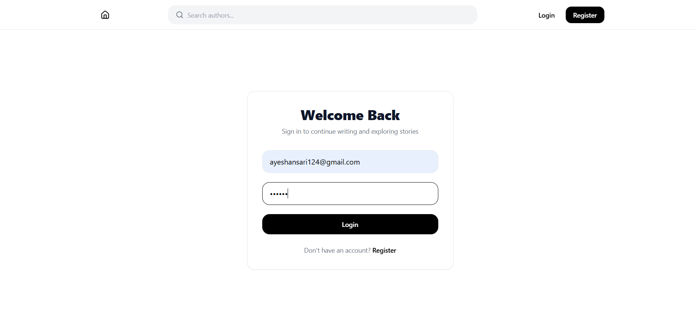
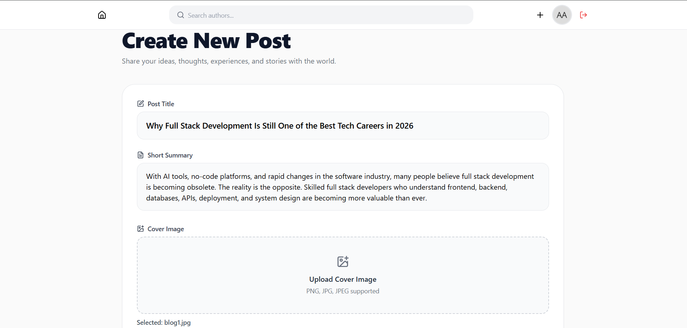
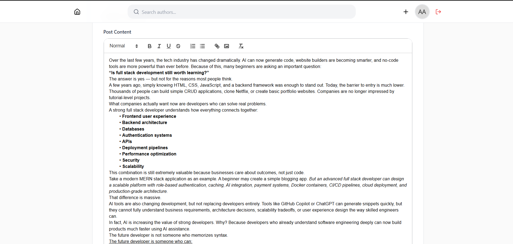
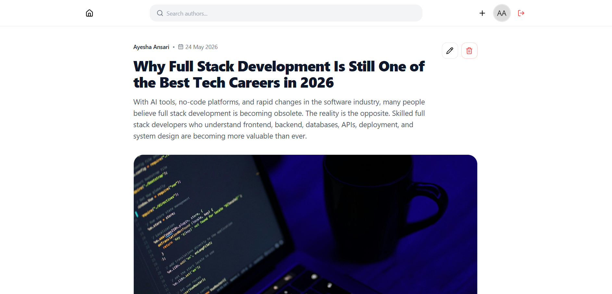
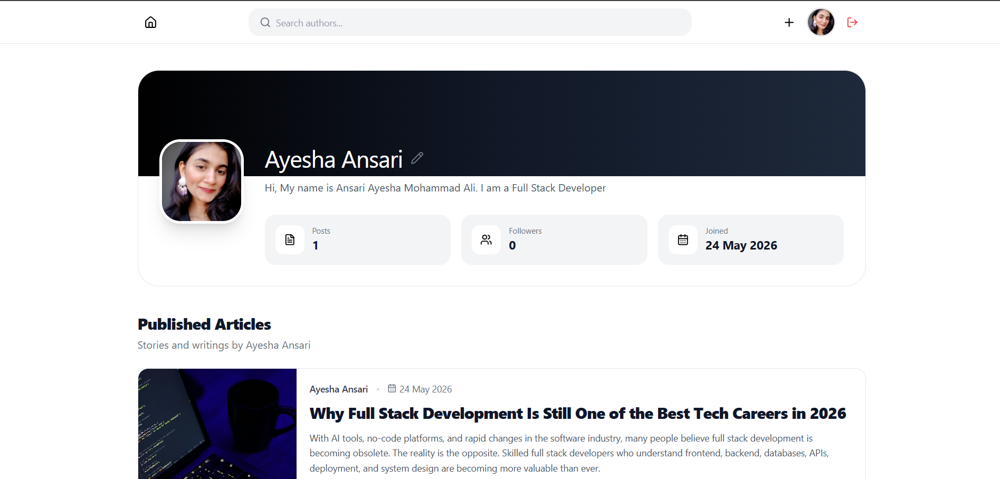
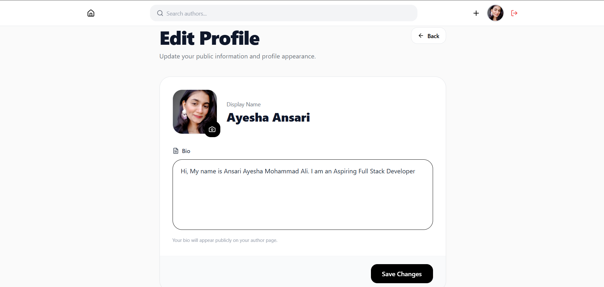
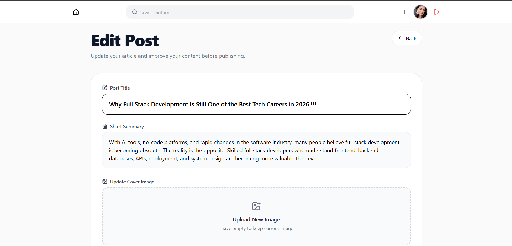
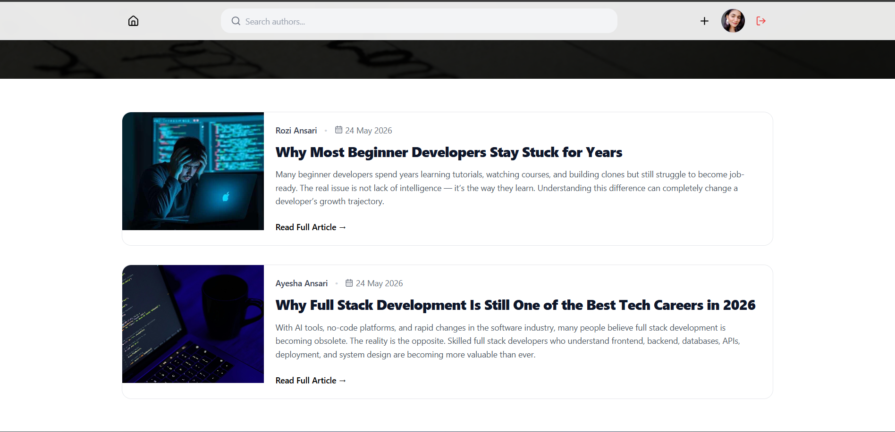
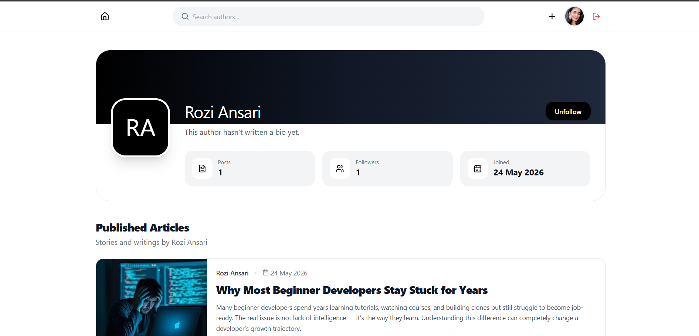
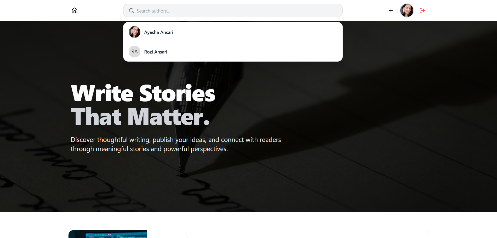

# ✍️ Inkwell - Modern Blogging Platform

Inkwell is a full-stack blogging platform where users can write articles, manage profiles, explore authors, and publish content through a modern writing experience.

## 🌐 Live Demo

https://ink-well-xi.vercel.app/

---

## ✨ User Features

- User signup, login, and logout
- Public article reading
- Create, edit, and delete articles
- Rich text editor using React Quill
- Upload article cover images
- Personalized author profiles
- Follow and unfollow authors
- Public profile viewing
- Search authors
- Featured homepage articles
- Joined date and profile stats
- Responsive design across devices

---

## 🚀 Tech Stack

### Frontend
- React.js
- React Router DOM
- Tailwind CSS
- React Quill
- Lucide React
- Date-fns
- Vite

### Backend
- Node.js
- Express.js
- MongoDB
- Mongoose
- JWT Authentication
- bcrypt
- Multer
- Cookie Parser
- CORS

---

## 📸 Screenshots

# 👤 User Side

### 🏠 Homepage

---

### 🔐 Authentication

---

### 📝 Create Article

---

### ✍️ Rich Text Editor

---

### 📖 Single Article View

---

### 👤 Personal Profile

---

### ⚙️ Edit Profile

---

### ✏️ Edit Articles

---

### 📰 Articles Feed

---

### 🌍 Public Author Profiles

---

### 🔍 Author Search

---

## 🧠 What I Learned

- JWT authentication workflows
- Protected routes and permissions
- REST API development
- MongoDB schema design
- Rich text editor integration
- File uploads using Multer
- Responsive React applications
- Context API state management
- Scalable MERN architecture
- User interaction workflows

---

## 💡 Future Improvements

- Comment system
- Article bookmarks
- Real-time notifications
- Dark mode
- Draft saving
- Infinite scrolling
- Trending articles
- Admin moderation panel

---

## 👩‍💻 Author

**Ayesha Ansari**

Built with ❤️ using React, Node.js, MongoDB, and Express